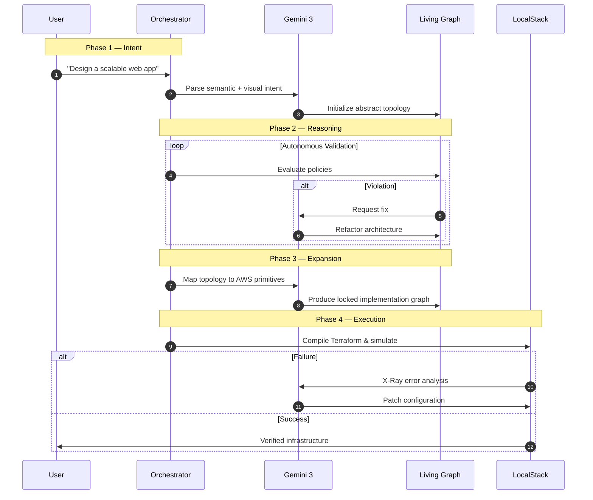

# 🧠 InfraMinds: The AI-Powered Cloud Architect

[](https://deepmind.google/technologies/gemini/)
[](https://fastapi.tiangolo.com/)
[](https://nextjs.org/)
[](https://www.terraform.io/)
[](https://localstack.cloud/)

> **Constraint-Driven Cloud Architecture — From Sketch to Verified Terraform**

**InfraMinds** is an autonomous infrastructure architect that converts human intent into a **Living Infrastructure Graph**, reasons over it, simulates consequences, and compiles verified Terraform — before a single cloud resource is deployed.

Unlike traditional “text-to-code” tools, InfraMinds prioritizes **system reasoning over generation**, transforming the AI from a black box into a transparent **Glass Box** where every architectural decision is visible, validated, and explainable.

---

## 📸 Demo


👉 **Watch the full 4K demo:**  
**[INSERT YOUTUBE / DRIVE LINK]**

---

## 🚨 Why InfraMinds Exists

We’ve entered the era of **vibe coding**, where AI can build applications from prompts.

But infrastructure remains a fortress.

Designing production-grade cloud systems demands deep expertise:

- One misconfigured subnet can expose a database  
- One routing error can cascade into outages  
- One dependency change can silently break services  

For novices, this is a wall.  
For experts, it’s a minefield.

### InfraMinds brings the AI IDE revolution to cloud architecture.

It empowers beginners to design like senior engineers — while giving experts a **reasoning engine** that predicts failure before deployment.

---

## ⭐ Core Innovation

InfraMinds shifts infrastructure from **reactive debugging → predictive design.**

Instead of generating Terraform directly, the system builds a persistent world model:

> **The Living Infrastructure Graph**

This graph becomes the source of truth for:

- Dependency reasoning  
- Policy validation  
- Blast radius simulation  
- Cost modeling  
- Autonomous correction  

Terraform is not the intelligence.

It is the compiled artifact.

---

## 🏗️ System Architecture

InfraMinds separates **Intent → Reasoning → Execution**, enforcing a strict unidirectional flow that prevents hallucination and ensures architectural integrity.


### 🧠 The 4-Phase Intelligence Loop

InfraMinds does not hallucinate infrastructure. **It thinks before it acts.**



---

## ✨ Key Capabilities

### 🎨 Intent → Blueprint (Multimodal)
Upload a sketch or describe a system. Gemini extracts spatial topology and converts it into a structured graph — not text.

### 💥 Blast Radius Simulation
Before deploying, InfraMinds predicts cascading failures by traversing dependency paths. You don’t discover breakage later. **You see it instantly.**

### 🛡️ Autonomous Self-Correction
If deployment simulation fails:
1. Errors are captured
2. The architecture is analyzed
3. The graph or configuration is patched
4. Deployment retries automatically

**Closed-loop infrastructure reasoning.**

### 🧠 Cognitive Trace ("Glass Box AI")
Watch the system reason in real time: *"Database cannot be public — relocating to private subnet."* Transparency builds trust.

---

## 🛠️ Tech Stack

| Layer | Technology | Role |
|-------|------------|------|
| **Frontend** | Next.js + React Flow | Visualization & Cognitive Trace |
| **Backend** | FastAPI | Orchestration |
| **AI Core** | Gemini 3 | Multimodal reasoning |
| **Graph Engine** | NetworkX | Dependency modeling |
| **Simulation** | LocalStack | Safe deployment |
| **IaC** | Terraform | Infrastructure compilation |

---

## 🚀 Quick Start

### Prerequisites
- Docker Desktop
- Node.js 18+
- Python 3.10+
- Google AI Studio Key

### 1. Backend Setup

```bash
git clone https://github.com/yourusername/InfraMinds.git
cd InfraMinds/backend

python -m venv .venv
source .venv/bin/activate   # Windows: .venv\Scripts\activate
pip install -r requirements.txt

echo "GOOGLE_API_KEY=your_key_here" > .env

uvicorn main:app --reload
```

### 2. Frontend Setup

```bash
cd ../frontend
npm install
npm run dev
```

Open: **http://localhost:3000**

### 3. Docker (Recommended)

Runs frontend, backend, and LocalStack together.

```bash
docker-compose up -d
```

---

## 📂 Project Structure

```bash
InfraMinds/
├── backend/
│   ├── main.py              # Entry point & API Routes
│   ├── agent.py             # Agent Logic (Gemini Interface)
│   ├── pipeline.py          # Self-healing Pipeline Manager
│   ├── prompts/             # System Prompts for AI Phases
│   └── requirements.txt     # Python Dependencies
├── frontend/
│   ├── app/                 # Page Layouts
│   ├── components/          # UI Components
│   │   ├── GraphVisualizer.tsx  # Main Graph View
│   │   └── AgentNeuralStream.tsx # AI Thought Log
│   └── lib/                 # API Clients & Utilities
└── doc/
    └── architecture.md      # Detailed Architecture Docs
```

---

## 🧭 Vision

InfraMinds represents a shift from **infrastructure generation → infrastructure cognition**.

Before code is written. Before resources are provisioned. The system already understands what will break — and fixes it.

### ⭐ Final Thought

Infrastructure shouldn’t start with configuration. It should start with understanding.

**InfraMinds is building that future.**

---

## ⭐ Why This Is Technically Novel

Most AI infrastructure tools (like `Pulumi AI` or `ChatGPT`) are **Single-Pass Generators**:
- Input: "Make an S3 bucket"
- Output: Terraform HCL

**InfraMinds implements a Multi-Pass Cognitive Architecture**:
1.  **Semantic Graph Layer**: It reasons about "Connectivity" and "Isolation" (graph properties), not just HCL syntax.
2.  **Constraint-Solving Loop**: It uses a `while(violation_exists)` loop to self-heal architecture *before* writing code.
3.  **Hybrid Verification**: It combines **Static Analysis** (policy checks) with **Dynamic Simulation** (LocalStack) to verify the actual runtime behavior of the generated code.

This moves the industry from **"AI that writes code"** to **"AI that understands systems."**

---

*(Built with ❤️ for the Hackathon)*
