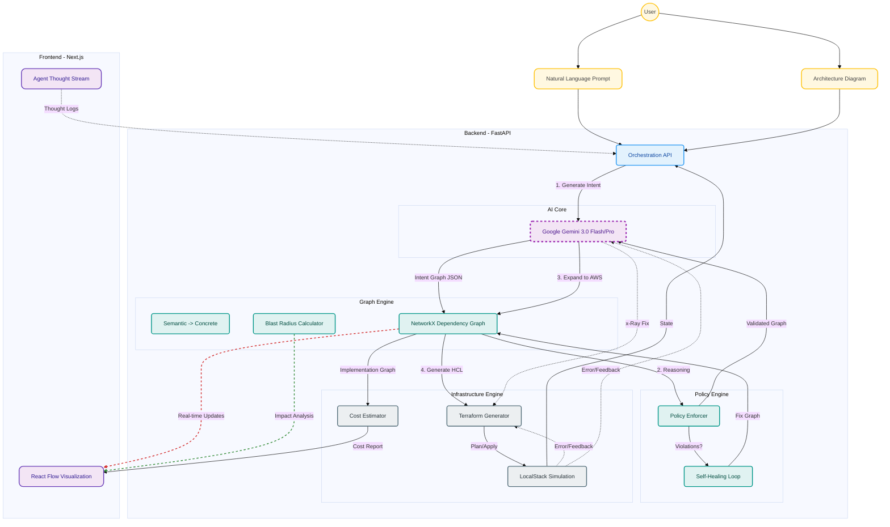
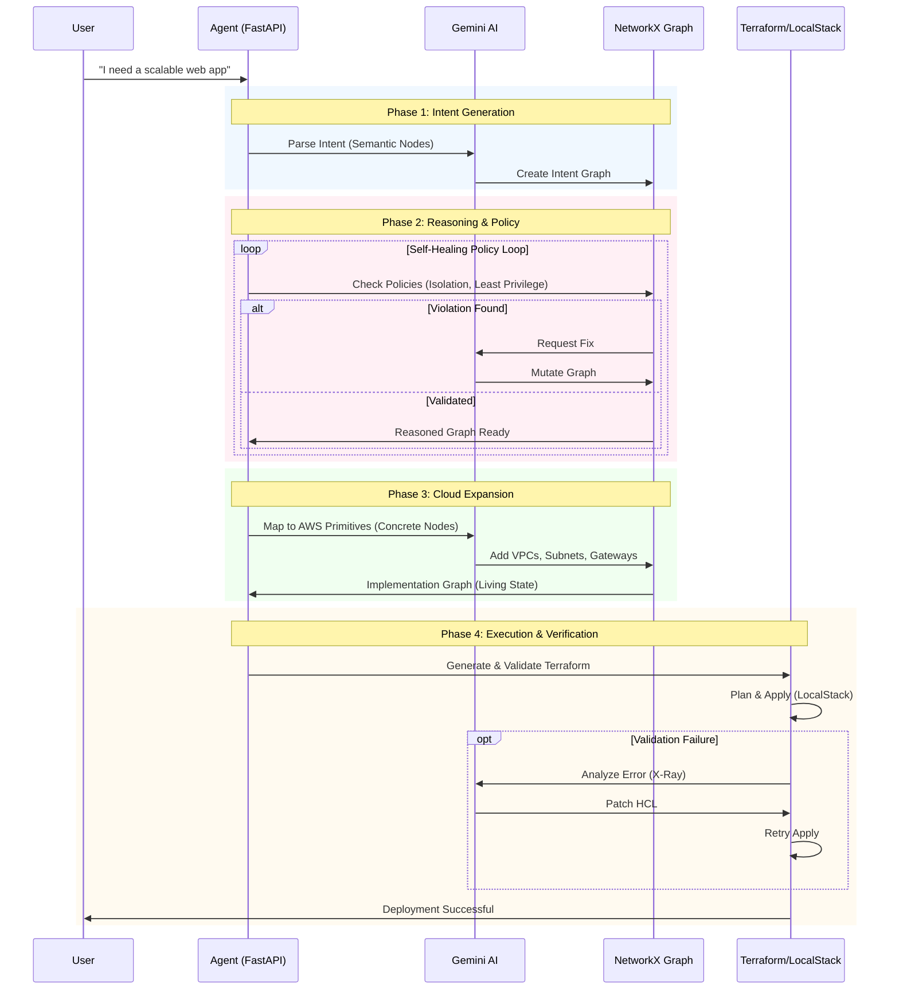

# InfraMinds System Architecture

This document details the architectural components and data flow of the InfraMinds system.

## High-Level Overview

InfraMinds is designed as a "Glass Box" system where every decision is transparent and verifiable. The core architecture revolves around a **Living State Graph** maintained by NetworkX, which evolves through 4 reasoning phases before being deployed.

## The 4-Phase Logic Flow

The system does not jump straight to code. It follows a rigorous 4-phase process to ensure correctness and policy compliance.

## Component Details

### 1. Intent Generator
- **Role**: Parses user input (text/image) into semantic infrastructure nodes.
- **Output**: Abstract Intent Graph (e.g., `Compute`, `Database`).

### 2. Policy & Reasoning Engine
- **Role**: Validates the graph against security and architectural best practices.
- **Mechanism**: Iterative self-healing. If a policy fails (e.g., public DB), the AI modifies the graph until it passes.

### 3. Graph Engine (NetworkX)
- **Role**: The source of truth. Maintains the dependency graph, handles topological sorts for deployment order, and calculates blast radius.

### 4. Expansion Agent
- **Role**: Converts semantic nodes to concrete provider resources (e.g., `AWS EC2`, `AWS RDS`), adding necessary scaffolding (VPC, IGW) that the user didn't explicitly request.

### 5. Execution Pipeline
- **Role**: Generates, validates, and applies Terraform code.
- **Features**: Includes a "Self-Correction Loop" where Terraform errors are fed back to the AI to generate fixes automatically.
